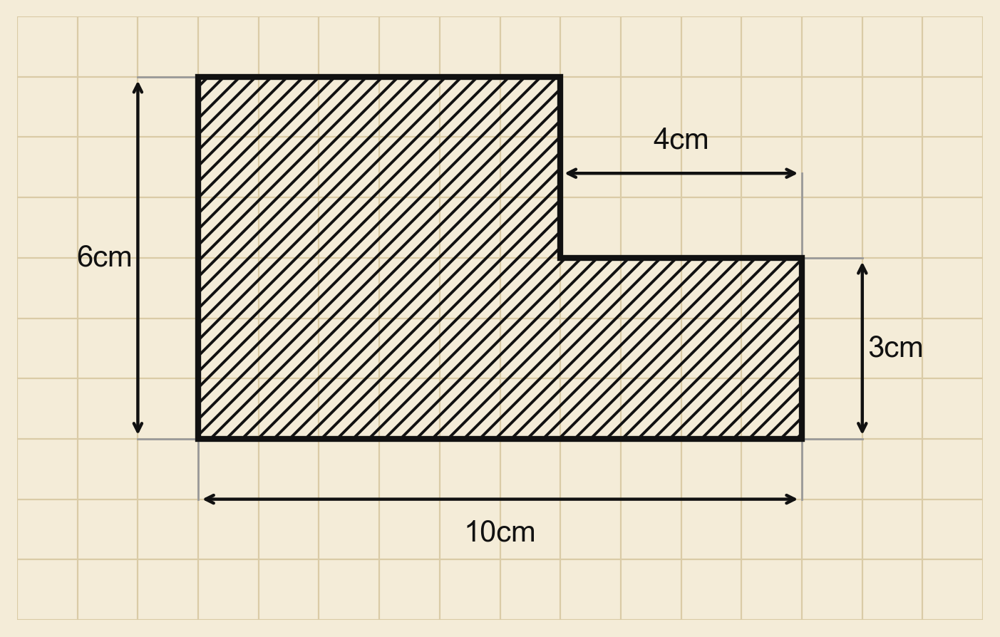

# 小学奥数出题器 · olympiad-problem-generator

一个给 **OpenClaw(龙虾)** 用的 Skill：一句话出一套**例题 + 练习 + 作业 + 参考答案**的小学奥数练习，自动配**课本风格几何图**，并落成 Word 文档。



## 它不一样的三个硬保证
1. **图用代码画，不用文生图** —— 自带出图引擎（米色方格纸·黑粗轮廓·45°斜线阴影·双箭头标注），标注自动甩到图形外留白、绝不压字、绝不裁切。几何题严禁用 AI 文生图（数字会乱、尺寸会错）。
2. **答案用代码算 + 交叉校验** —— 每道题的结果用 Python 计算并两法对照，通过才写进文档。
3. **图文数据同源** —— 图里的尺寸、题干的数字、校验脚本的变量是同一组，不打架。

---

## 📦 安装（学员照做，复制这一行）

```bash
git clone https://github.com/vickysy/olympiad-problem-generator.git ~/.openclaw/skills/olympiad-problem-generator
```

装完确认一下（能看到 `olympiad-problem-generator ✓ ready` 就成功）：

```bash
openclaw skills list | grep olympiad
```

> 没装 `git` 的话，也可以在本仓库页面点 **Code → Download ZIP**，解压后把整个文件夹放到 `~/.openclaw/skills/` 下。

## 🔄 更新到最新版

```bash
git -C ~/.openclaw/skills/olympiad-problem-generator pull
```

## ▶️ 用法

在龙虾里直接说，例如：

> 给三年级出一套「巧求面积」的题，难度举一反三

或触发词：出题、奥数出题、给X年级出题、小学奥数出题。

## 🧩 依赖

首次运行会自动 `pip install matplotlib python-docx`（出图用 matplotlib，纯 Python、无需浏览器，host / 容器都能跑）。

---

## 目录结构
```
olympiad-problem-generator/
├── SKILL.md            # 出题流程 SOP + 三大硬保证（龙虾读这个）
└── scripts/
    ├── draw_figure.py  # 课本风格几何图引擎
    └── build_doc.py    # 出 Word（按结构、图片嵌入）
```

由 木妈AIdea 制作 🌿
